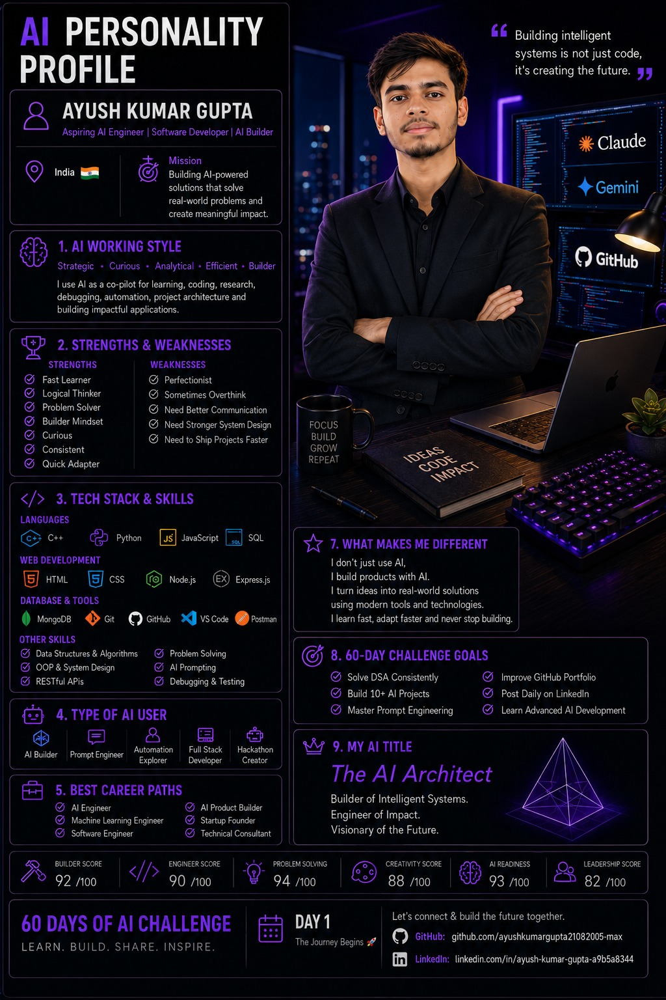

# 🚀 60 Days of AI Challenge

> **Learn • Build • Share • Repeat**



---

# 👋 About Me

Hi, I'm **Ayush Kumar Gupta**.

I'm an aspiring **AI Engineer** and **Software Developer** from India, passionate about building AI-powered applications, solving real-world problems, and continuously learning new technologies.

This repository documents my **60 Days of AI Challenge**, where I'll share my daily progress, AI projects, learning notes, and technical growth.

---

# 🎯 Challenge Goals

- 🤖 Learn AI Development
- 🧠 Master Prompt Engineering
- 💻 Build Real AI Projects
- 📈 Improve DSA & Problem Solving
- 🌐 Strengthen Full Stack Development
- 📚 Learn in Public
- 🚀 Build a Strong GitHub Portfolio

---

# 🛠️ Tech Stack

## Programming Languages

- C++
- Python
- JavaScript
- SQL

## Web Development

- HTML
- CSS
- Node.js
- Express.js

## Database

- MongoDB

## AI & Development Tools

- Claude AI
- Google Gemini
- Git
- GitHub
- VS Code
- Postman

---

# 📅 Challenge Progress

| Day | Topic | Status |
|-----|-------|--------|
| Day 1 | AI Personality Profile & Portfolio Setup | ✅ Completed |

---

# 📂 Repository Structure

```text
60-days-of-ai/
│
├── README.md
├── assets/
│   └── day-01-ai-profile.png
│
├── day-01/
│   ├── notes.md
│   └── screenshots/
│
├── projects/
│
└── resources/
```

---

# 🌱 Currently Learning

- Artificial Intelligence
- Prompt Engineering
- AI Agents
- Claude
- Google Gemini
- Full Stack Development
- Data Structures & Algorithms
- System Design

---

# 🚀 My Mission

Build AI-powered software that solves meaningful real-world problems while continuously learning, improving, and sharing the journey publicly.

---

# 🎯 60-Day Targets

- ✅ Build 10+ AI Projects
- ✅ Solve DSA Daily
- ✅ Improve GitHub Portfolio
- ✅ Post Daily on LinkedIn
- ✅ Learn Advanced AI Development
- ✅ Become a Better Software Engineer

---

# 📌 Daily Progress

## ✅ Day 1

- Created my AI Personality Profile
- Designed my AI Portfolio Poster
- Started the 60 Days of AI Challenge
- Created this GitHub repository
- Shared my journey publicly

---

# 📈 Future Goals

- Build Production-Level AI Applications
- Contribute to Open Source
- Participate in Hackathons
- Improve System Design Skills
- Master AI Engineering
- Secure an AI Software Engineering Role

---

# 📬 Connect With Me

### GitHub

https://github.com/ayushkumargupta21082005-max

### LinkedIn

https://www.linkedin.com/in/ayush-kumar-gupta-a9b5a8344/

---

# 💡 Quote

> "Consistency beats intensity. One project, one lesson, one step at a time."

---

# ⭐ If you like this journey

Give this repository a ⭐ and follow along as I build, learn, and grow over the next **60 Days of AI**.

---

## 🚀 Day 1 Complete

**Learn • Build • Share • Repeat**
